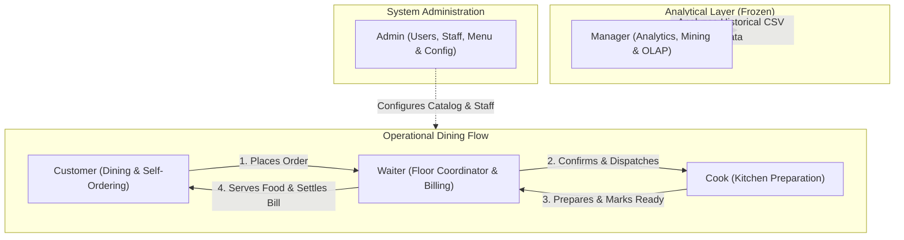
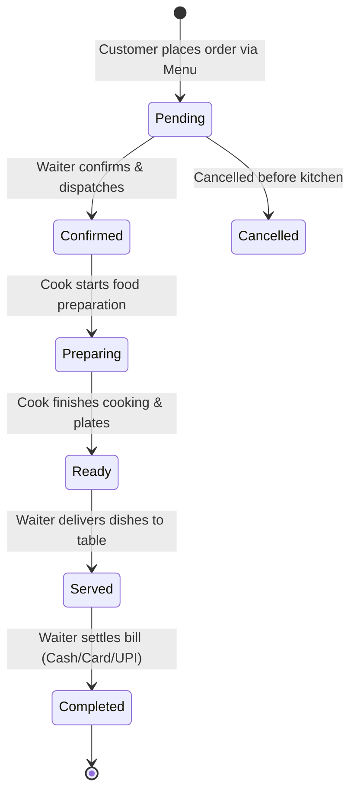

# Restaurant Management System

A role-based, unified restaurant management platform combining operational floor management, kitchen dispatch, customer self-ordering, system administration, and enterprise data warehousing with in-browser data mining and OLAP analytics.

---

## Overview

Modern food service enterprises face a structural dilemma: operational workflows (guest ordering, table management, kitchen tickets, billing) require fast, reactive state coordination, while executive management requires historical business intelligence, predictive modeling, and multidimensional analytics. 

The **Restaurant Management System (RMS)** bridges this gap by unifying two distinct layers into a single cohesive web application:

1. **Operational Layer**: Real-time dining operations across Customer, Waiter, Cook, and Admin roles using a synchronized reactive operational state machine.
2. **Analytical Layer**: Historical business intelligence for Managers powered by a dedicated Data Warehouse ETL pipeline, multidimensional OLAP cubes, and client-side Machine Learning / Data Mining algorithms.

Crucially, **operational responsibilities and analytical responsibilities are strictly separated**:
- **Customer**, **Waiter**, **Cook**, and **Admin** focus purely on operational execution without distraction from analytical charts or machine learning.
- **Manager** focuses on business health, predictive forecasting, classification, customer segmentation, and reporting without interfering in live table tickets.
- All roles share a consistent, light-themed SaaS design system where the **Manager UI serves as the single master visual reference**.

---

## Key Features

### 1. Manager (Analytics, Data Mining & Warehousing)
The Manager module operates on the historical restaurant dataset (`tarri_data.csv`) and provides enterprise decision support:

- **Executive Dashboard**: Real-time operational pulse, historical KPI metrics (Total Gross Sales, Net Profit, Average Order Value, Profit Margin), sales trajectories, channel distribution, and top-selling menu items.
- **Overview Analytics**: High-level financial summaries, quarterly growth tracking, and operational volume breakdowns.
- **Sales Analytics**: Revenue and profit trends over time, day-of-week heatmaps, peak order hour distribution, and fulfillment channel velocity (Delivery vs. Collection).
- **Customer Analytics**: Guest ordering frequencies, order volume distribution, average basket spend analysis, and repeat customer retention patterns.
- **Product Analytics**: Menu profitability matrix, category contribution charts, dish popularity rankings, and price elasticity inspection.
- **Data Mining — Regression**: Univariate Linear Regression, Multiple Linear Regression (OLS), and Random Forest Regression (12 bagged trees) with automatic $R^2$, MAE, and RMSE evaluation to select the best predictive model.
- **Data Mining — Classification**: Multi-target classification (Order Type, Category, Profitability Tier) using Logistic Regression (L2 regularized), Decision Tree (Gini Impurity, depth=5), and Random Forest Classifier (15 trees) with confusion matrices, macro precision/recall/F1, and feature importance.
- **Data Mining — Clustering**: Order-level $K$-Means clustering ($K=2$ to $6$) evaluated via Within-Cluster Sum of Squares (Inertia/Elbow) and Silhouette Scores with 2D feature projection and persona profiles.
- **Data Warehouse — Datasets**: Raw dataset inspection, schema browser, data quality audit (completeness, null detection, duplicates, invalid records), and statistical distributions.
- **Data Warehouse — ETL Pipeline**: 3-stage Extract-Transform-Load visual pipeline transforming raw CSV data into a logical Star Schema (`FACT_SALES_LINE_ITEM` and 4 Dimension tables).
- **Data Warehouse — OLAP Explorer**: In-memory multidimensional cube supporting **Slice**, **Dice**, **Drill-down**, and **Roll-up** across Time, Product, Category, and Channel hierarchies.
- **Reports**: Configurable enterprise report generation (Executive Summary, Sales Audit, Product Profitability, ML Model Audit) with CSV export and print-ready PDF styling.
- **Profile**: Manager clearance, administrative privileges, and session metadata.

### 2. Waiter (Floor Management & Service Coordination)
The Waiter role is a dedicated restaurant floor and service coordinator:

- **Waiter Dashboard**: Real-time floor operational metrics (**Tables Assigned**, **Occupied Tables**, **Orders Preparing**, **Ready for Service**, **Customer Requests**), urgent customer request alerts, ready-to-serve notifications, and table turnover notices.
- **Table Management (`/waiter/tables`)**: Visual dining floor plan representing actual table states (`Available`, `Occupied`, `Ready to Serve`, `Needs Attention`, `Needs Reset`) with contextual actions (*Seat / Open Table*, *View Table*, *Serve Order*, *Mark Table Ready*).
- **Customer Service Requests (`/waiter/requests`)**: Dedicated desk for handling guest requests (*Request Waiter*, *Request Water*, *Request Bill*, *Extra Cutlery*, *Extra Napkins*, *Other*) with a 3-step state cycle: `Pending` $\to$ `Acknowledged` $\to$ `Completed`.
- **Active Orders Monitoring (`/waiter/orders`)**: Ledger of customer orders with live status monitoring. Includes kitchen coordination (*Confirm Order*, *Send to Kitchen*) and pre-cooking order modifications (adjust quantities, remove items, edit special notes).
- **Ready for Service Orders (`/waiter/orders/ready`)**: Dedicated order pickup screen. When the kitchen completes a ticket, waiters execute `[ SERVE ORDER ]`, advancing status to `Served`.
- **Table Billing & Payment (`/waiter/bills`)**: Table-side bill management and settlement supporting **Cash**, **Card**, or **UPI** payment methods.
- **Table Turnover**: Settling a bill transitions the table to `Needs Reset` (not automatically available). Waiters conduct table sanitation and click `[ Mark Table Available ]` to complete the dining cycle.
- **Order History (`/waiter/orders/history`)**: Chronological archive of completed floor orders and payment methods.
- **Profile**: Waiter staff ID, shift details, and credentials.

### 3. Cook (Kitchen Operations & Food Preparation)
The Cook module is an order preparation board:

- **Kitchen Dashboard (`/cook/dashboard`)**: Kanban-style ticket board organized by operational stages:
  - **New Orders (Incoming)**: Confirmed orders received from floor staff awaiting preparation. Action: `[ Start Preparing ]`.
  - **Preparing (In Progress)**: Dishes currently being cooked with live elapsed timers, item quantities, and special kitchen instructions. Action: `[ Mark Ready ]`.
  - **Ready (Completed)**: Plated orders awaiting waiter pickup and table delivery.
- **Order Preparation Workflow**: Direct transition from `Confirmed` $\to$ `Preparing` $\to$ `Ready`.
- **Kitchen Ticket Inspection**: Filter tickets by category, search by order number or dish name, and highlight special allergy/kitchen instructions.
- **Profile**: Kitchen station credentials and chef profile.

### 4. Customer (Dining & Self-Service Ordering)
The Customer module provides a dining and ordering experience with authentic restaurant terminology:

- **Customer Dashboard (`/customer/dashboard`)**: Personalized welcome, active order tracking card with real-time status progression, quick restaurant navigation, and 1-tap table service request buttons.
- **Restaurant Menu (`/customer/menu`)**: Categorized digital menu (Appetisers, Main Courses, Soups, Extras, Drinks) with real-time dish availability badges, search filter, quantity selectors, and primary `[ Add to Order ]` action.
- **Current Order (`/customer/cart`, `/customer/order`)**: Interactive dining order review displaying dining table selector, itemized order items, quantity controls, remove buttons, special kitchen instructions, subtotal, and `[ Place Order ]`.
- **Live Order Tracking (`/customer/orders/:id`)**: Real-time 5-stage visual progress stepper (`Order Placed` $\to$ `Confirmed` $\to$ `Kitchen Preparing` $\to$ `Ready for Service` $\to$ `Served to Table` $\to$ `Completed`).
- **Table Service Assistance**: In-page assistance buttons (*Request Waiter*, *Request Water*, *Request Bill*, *Extra Cutlery*, *Extra Napkins*) with immediate feedback (*Waitstaff Notified* $\to$ *Staff On The Way* $\to$ *Fulfilled*).
- **My Orders (`/customer/orders`)**: Active dining order spotlight alongside complete past order history.
- **My Bills (`/customer/bills`)**: Itemized billing breakdown, payment status, and historical payment receipts.
- **Profile**: Guest dining account credentials and assigned table preferences.

### 5. Admin (System Administration & Master Catalog)
The Admin module manages system configuration, staff accounts, and operational assets:

- **Admin Dashboard (`/admin/dashboard`)**: High-level system counters (Total Staff, Active Floor Tables, Active Orders, Menu Catalog Items) with quick operational shortcuts.
- **User Management (`/admin/users`)**: Master ledger of all system accounts across all 5 roles, role filter tabs, status toggles (Active / Inactive), profile edits, and root administrator protection.
- **Staff Management (`/admin/staff`)**: Dedicated employee roster for Manager, Waiter, and Cook staff with "Add Staff Member" modal, email validation, and role assignment.
- **Menu Catalog Management (`/admin/menu`)**: Live CRUD interface for restaurant dishes (Name, Category, Price in £ GBP) and instant 1-click dish availability toggles reflected in real time across customer menus.
- **Table Management (`/admin/tables`)**: Dining room table configuration (Table Number, Seat Capacity, Status) with duplicate table number protection.
- **Order Management (`/admin/orders`)**: Operational orders audit ledger displaying source tags (`CUSTOMER` vs. `WAITER`), full item inspection modal, and strict state transition overrides.
- **Settings (`/admin/settings`)**: Restaurant branding metadata, currency formatting (£ GBP), tax rates, service charges, and system operational defaults saved in persistent storage.
- **Profile**: System administrator credentials and access clearance.

---

## Role Architecture

The application enforces a separation between operational execution, executive business intelligence, and system administration:



### Separation of Responsibilities

| Role | Primary Responsibility | Primary Workspace | Analytics Access |
|:---|:---|:---|:---:|
| **Customer** | Menu browsing, self-order creation, order tracking, bill lookup, assistance calls | Dining Floor & Mobile | None |
| **Waiter** | Table management, order confirmation, kitchen dispatch, food serving, billing, table turnover | Dining Room Floor | None |
| **Cook** | Ticket receipt, food preparation, mark ready for delivery | Kitchen Display System | None |
| **Manager** | Business health analysis, predictive modeling, clustering, ETL, OLAP cubes, executive reports | Executive Suite | Full |
| **Admin** | Employee accounts, menu catalog CRUD, table capacity, system settings, operational ledger | Back Office | None |

---

## Order Workflow

The operational order lifecycle connects Customer, Waiter, and Cook through a single shared operational record:



### Step-by-Step Lifecycle

1. **Order Creation (`Pending`)**:
   - Customer browses `/customer/menu`, selects dishes, reviews `/customer/order`, chooses an available dining table, and clicks `[ Place Order ]`.
   - The order record is created with `source: 'CUSTOMER'`, `status: 'Pending'`, and the table status updates to `Occupied`.
2. **Waiter Coordination (`Confirmed`)**:
   - Waiter observes the new order in `/waiter/orders`.
   - If modifications are needed before cooking (e.g. adjust quantities, add notes such as "no onions"), the Waiter edits the order via `[ Modify ]`.
   - Waiter clicks `[ Confirm Order ]` followed by `[ Send to Kitchen ]`. Order status becomes `Confirmed`.
3. **Kitchen Preparation (`Preparing`)**:
   - Cook receives the ticket under "New Orders" on `/cook/dashboard`.
   - Cook clicks `[ Start Preparing ]`. Status transitions to `Preparing`.
   - *Guard*: Once in `Preparing`, arbitrary item modifications are locked to prevent kitchen confusion.
4. **Kitchen Completion (`Ready`)**:
   - When cooking is completed, Cook clicks `[ Mark Ready ]`. Status becomes `Ready`.
   - The ticket moves to Cook's completed section and instantly alerts floor staff.
5. **Table Delivery (`Served`)**:
   - The order appears immediately in Waiter's `/waiter/orders/ready`.
   - Waiter physically brings dishes to the table and clicks `[ SERVE ORDER ]`. Status updates to `Served`.
   - Customer's live order tracker updates to `Served to Table`.
6. **Billing & Settlement (`Completed`)**:
   - Guest requests the bill (or clicks "Request Bill" from their dashboard).
   - Waiter opens `/waiter/bills`, reviews itemized totals, clicks `[ Take Payment ]`, selects method (**Cash**, **Card**, or **UPI**), and confirms.
   - Payment status becomes `Paid` and order status becomes `Completed`.
7. **Table Turnover**:
   - Upon payment, the table status transitions to **`Needs Reset`** (not automatically available).
   - Waiter cleans and resets the table, then clicks `[ Mark Table Available ]`. The table returns to `Available` for incoming guests.

---

## Data Mining

The Manager module includes mathematical and statistical algorithms executed in the browser against `tarri_data.csv`:

### 1. Regression Analysis (`/manager/mining/regression`)
Predicts numeric business outcomes (e.g. Gross Sales or Estimated Profit):

- **Target Variables**: `Gross Sales`, `Est. Profit`.
- **Input Features**: `Quantity`, `Price Per Item`, `Est. Cost`.
- **Train/Test Splitting**: Configurable 80/20 train-test split using a seeded Pseudo-Random Number Generator (PRNG, seed: 42) for deterministic evaluation.
- **Implemented Models**:
  1. *Simple Linear Regression*: Univariate baseline fit via standard least squares formula:
     $$\beta_1 = \frac{\sum (x_i - \bar{x})(y_i - \bar{y})}{\sum (x_i - \bar{x})^2}, \quad \beta_0 = \bar{y} - \beta_1 \bar{x}$$
  2. *Multiple Linear Regression (OLS)*: Multivariate Ordinary Least Squares using normal equations solved via matrix transposition and Gaussian Jordan inversion with Ridge regularization ($\lambda = 10^{-6}$):
     $$\hat{\beta} = (X^T X + \lambda I)^{-1} X^T y$$
  3. *Random Forest Regressor*: Ensemble of 12 bagged regression trees grown to a maximum depth of 5 with feature subsampling ($\sqrt{p}$) and bootstrap aggregation.
- **Evaluation Metrics**:
  - $R^2$ (Coefficient of Determination)
  - MAE (Mean Absolute Error)
  - RMSE (Root Mean Squared Error)
- **Model Comparison & Recommendation**: Models are ranked quantitatively primarily by maximum test $R^2$ with secondary tie-break on minimum MAE. The system generates feature coefficient interpretations and feature importance rankings.

### 2. Classification Analysis (`/manager/mining/classification`)
Classifies operational categories and service types:

- **Classification Targets**:
  - `OrderType` (Binary: Delivery vs. Collection)
  - `Category` (Multiclass: Appetisers, Main Courses, Soups, Extras, Drinks, etc.)
  - `ProfitabilityTier` (Binary: High Margin vs. Standard Margin)
- **Input Features**: `Quantity`, `Price Per Item`, `Gross Sales`, `Est. Cost`, `Hour of Day`, `Day of Week`.
- **Data Preprocessing**: One-hot encoding for categorical variables, min-max feature scaling, and class distribution balancing.
- **Implemented Models**:
  1. *Logistic Regression*: L2-regularized binary logistic regression with sigmoid activation ($\sigma(z) = \frac{1}{1 + e^{-z}}$) and One-vs-Rest (OvR) multi-class decomposition trained via batch gradient descent.
  2. *Decision Tree Classifier*: Recursive binary splitting tree utilizing **Gini Impurity** ($I_G = 1 - \sum p_i^2$), maximum depth of 5, and minimum split sample size of 10.
  3. *Random Forest Classifier*: Ensemble of 15 bagged decision trees with bootstrap sampling and $\sqrt{p}$ random candidate feature selection.
- **Evaluation Metrics**: Macro-averaged Accuracy, Precision, Recall, F1-Score, and a complete Confusion Matrix (TP, FP, TN, FN).
- **Best Model Selection**: Automatically selected based on highest Macro F1-Score.

### 3. Clustering Analysis (`/manager/mining/clustering`)
Discovers customer purchasing personas and order spending patterns:

- **Order-Level Aggregation**: Line items from `tarri_data.csv` are aggregated by unique `OrderID` to construct order-level profiles with features:
  - `totalQuantity` (Total items in basket)
  - `totalGrossSales` (Total basket spend)
  - `totalEstProfit` (Total basket margin)
  - `avgPricePerItem` (Average dish price point)
  - `lineItemCount` (Number of distinct menu items)
- **Preprocessing**: $Z$-score standardization ($\mu = 0, \sigma = 1$) to eliminate scale bias.
- **Algorithm**: $K$-Means clustering initialized using **$K$-Means++** (distance-squared probability seeding $\frac{D(x)^2}{\sum D(x)^2}$) with iterative centroid recalculation (maximum 50 iterations).
- **Evaluation ($K = 2$ through $6$)**:
  - *Inertia (Within-Cluster Sum of Squares, WCSS)*: Computes the elbow curve:
    $$\text{WCSS} = \sum_{k=1}^K \sum_{x \in C_k} \|x - \mu_k\|^2$$
  - *Silhouette Score*: Evaluates intra-cluster cohesion $a(i)$ against nearest-cluster separation $b(i)$:
    $$s(i) = \frac{b(i) - a(i)}{\max(a(i), b(i))}$$
- **Optimal $K$ Determination**: Recommends the $K$ value achieving the maximum overall Silhouette Score and provides persona profiles (e.g. High-Volume Group Orders vs. Quick Single Diners).

---

## Data Warehouse

The Manager module includes a Data Warehouse subsystem demonstrating ETL processing, dimensional modeling, and OLAP analytics:

### 1. ETL Pipeline (`/manager/warehouse/etl`)
A 3-stage visual ETL engine processing `tarri_data.csv`:

```
┌─────────────────┐       ┌────────────────────────┐       ┌──────────────────────┐
│  STAGE 1:       │       │  STAGE 2:              │       │  STAGE 3:            │
│  EXTRACT        │  ──>  │  TRANSFORM             │  ──>  │  LOAD                │
│  4,385 lines    │       │  Type casting, date    │       │  Star Schema         │
│  Source Schema  │       │  parsing, validation   │       │  Fact & Dimensions   │
└─────────────────┘       └────────────────────────┘       └──────────────────────┘
```

- **Extract**: Ingestion of 4,385 raw transaction lines from `public/tarri_data.csv`. Validates 14 column headers and identifies record boundaries.
- **Transform**: 
  - Standardizes dates from UK format (`DD/MM/YYYY`) to ISO format and builds calendar hierarchies (`Year`, `Month`, `DayOfWeek`, `Quarter`).
  - Cleans string whitespace, standardizes categorical values, and maps order-level groups (1,408 unique order IDs).
  - Flags and isolates 24 cancelled records.
  - Computes Data Quality Reports (Completeness: 100%, Accuracy: 99.5%, Duplicate rows: 0).
- **Load**: Populates an analytical Star Schema in memory for OLAP queries.

### 2. Logical Star Schema

```
                  ┌──────────────────────────────┐
                  │           DIM_DATE           │
                  ├──────────────────────────────┤
                  │ DateKey (PK)                 │
                  │ CalendarDate                 │
                  │ Year, Month, DayOfWeek       │
                  │ Quarter                      │
                  └──────────────┬───────────────┘
                                 │
                                 │ 1:N
                                 ▼
┌───────────────────────────┐  ┌──────────────────────────────────┐  ┌───────────────────────────┐
│        DIM_PRODUCT        │  │       FACT_SALES_LINE_ITEM       │  │        DIM_CHANNEL        │
├───────────────────────────┤  ├──────────────────────────────────┤  ├───────────────────────────┤
│ ProductKey (PK)           │  │ LineItemID (PK)                  │  │ ChannelKey (PK)           │
│ LineItemName              ├──┤ DateKey (FK)                     ├──┤ OrderType (Delivery/Coll) │
│ Category                  │  │ ProductKey (FK)                  │  │ PaymentMethod (Card)      │
│ BasePrice                 │  │ ChannelKey (FK)                  │  └───────────────────────────┘
└───────────────────────────┘  │ StatusKey (FK)                   │
                               │ Quantity                         │  ┌───────────────────────────┐
                               │ PricePerItem                     │  │        DIM_STATUS         │
                               │ GrossSales                       │  ├───────────────────────────┤
                               │ EstCost                          ├──┤ StatusKey (PK)            │
                               │ EstProfit                        │  │ IsCancelled, AuditFlag    │
                               └──────────────────────────────────┘  └───────────────────────────┘
```

- **Fact Table**: `FACT_SALES_LINE_ITEM` (4,385 records). Measures: `Quantity`, `Price Per Item`, `Gross Sales`, `Est. Cost`, `Est. Profit`.
- **Dimension Tables**:
  - `DIM_DATE`: DateKey, CalendarDate, Year, Month, DayOfWeek, Quarter.
  - `DIM_PRODUCT`: ProductKey, LineItemName, Category, BasePrice.
  - `DIM_CHANNEL`: ChannelKey, OrderType (`Delivery` / `Collection`), PaymentMethod (`Card`).
  - `DIM_STATUS`: StatusKey, IsCancelled, AuditFlag (Active vs. Cancelled).

### 3. OLAP Explorer (`/manager/warehouse/olap`)
Interactive multidimensional cube query engine supporting four operations:

- **Slice**: Isolates a single dimension slice (e.g. viewing sales strictly where `OrderType = 'Delivery'`).
- **Dice**: Filters across multiple dimensions simultaneously (e.g. `Category IN ('MAIN COURSES', 'APETISERS')` AND `DayOfWeek = 'Friday'`).
- **Drill-down**: Expands summary totals into deeper granularity (e.g. drilling down from `Category` to individual `Product` items, or from `Year` to `Month` to `Date`).
- **Roll-up**: Aggregates fine-grained granular transactions into higher-level executive categories (e.g. rolling individual dishes up to parent food categories or monthly summaries).

---

## Dataset

The analytical system uses `public/tarri_data.csv`. The statistics below are calculated from the actual dataset:

- **Total Rows**: 4,385 transaction line items (+ 1 header line = 4,386 total lines)
- **Total Columns**: 14
- **Unique Orders**: 1,408 orders
- **Date Coverage**: February 1, 2023 (`01/02/2023`) to December 31, 2025 (`31/12/2025`)
- **Recorded Channels**: Delivery and Collection
- **Recorded Payment Method**: Card
- **Cancelled Transactions**: 24 line items
- **Product Categories**:
  - `APETISERS`
  - `MAIN COURSES`
  - `SOUPS`
  - `EXTRAS`
  - `DRINKS`
  - `SPECIAL ORDERS`
  - `Restaurant DEALS`
  - `Friday Specials`

### Data Boundary Rule
`tarri_data.csv` represents **historical analytical data** only. Live operational orders created in the Customer or Waiter modules reside in the operational storage layer and do **not** overwrite or mutate `tarri_data.csv`.

---

## Technology Stack

Verified against `package.json`:

| Category | Technology | Version | Purpose |
|:---|:---|:---|:---|
| **Core Framework** | React | `^19.2.8` | Component-driven user interface architecture |
| **DOM Renderer** | React DOM | `^19.2.8` | Virtual DOM rendering |
| **Language** | TypeScript | `~6.0.2` | Static type safety and data models |
| **Build Tool & Server** | Vite | `^8.3.0` | Hot Module Replacement (HMR) and production bundler |
| **Routing** | React Router DOM | `^7.18.4` | Client-side routing, protected routes, and layouts |
| **Styling** | Tailwind CSS | `^4.3.3` | Utility-first CSS via `@tailwindcss/vite` |
| **Data Visualization** | Recharts | `^3.10.1` | Bar charts, line charts, scatter plots, and area metrics |
| **Icons** | Lucide React | `^1.46.0` | Consistent iconography across all modules |
| **Linter** | Oxlint | `^1.81.0` | High-speed Rust-based code linter |

---

## Project Structure

```
c:\Users\Rohan\Desktop\DWM-mini_project/
├── public/
│   ├── favicon.svg                 # Application favicon
│   ├── icons.svg                   # Vector icon definitions
│   └── tarri_data.csv              # Historical analytical dataset (4,385 rows)
├── src/
│   ├── components/
│   │   ├── layout/                 # Sidebars and Headers per role (Manager, Waiter, Cook, Customer, Admin)
│   │   └── ui/                     # Shared UI primitives (Card, Button, Badges, Metrics)
│   ├── context/                    # AuthContext and state providers
│   ├── data/                       # Initial operational seed data
│   ├── hooks/
│   │   ├── useAuth.ts              # Authentication state and login/logout handlers
│   │   ├── useCart.ts              # Customer order draft state and table binding
│   │   └── useOperationalData.ts   # Unified reactive hook for orders, tables, and requests
│   ├── layouts/                    # Role-specific layouts (ManagerLayout, WaiterLayout, CookLayout, etc.)
│   ├── pages/
│   │   ├── RoleSelection.tsx       # Landing portal for selecting role login
│   │   ├── admin/                  # Admin module pages (Dashboard, Users, Staff, Menu, Tables, Orders, Settings)
│   │   ├── auth/                   # Shared authentication components
│   │   ├── cook/                   # Cook module pages (Login, Dashboard, Profile)
│   │   ├── customer/               # Customer module pages (Login, Dashboard, Menu, Cart, Orders, Detail, Bills)
│   │   ├── manager/                # Manager module pages
│   │   │   ├── Dashboard.tsx       # Executive KPI dashboard
│   │   │   ├── Overview.tsx        # High-level analytics overview
│   │   │   ├── Sales.tsx           # Sales trend analytics
│   │   │   ├── Customers.tsx       # Customer order spending analytics
│   │   │   ├── Products.tsx        # Product profitability analytics
│   │   │   ├── mining/             # Regression, Classification, Clustering pages
│   │   │   ├── warehouse/          # Datasets, ETL Pipeline, OLAP Explorer pages
│   │   │   ├── reports/            # Enterprise reporting with CSV/print export
│   │   │   └── profile/            # Manager clearance profile
│   │   └── waiter/                 # Waiter module pages (Dashboard, Tables, Requests, ActiveOrders, ReadyOrders, Bills, History)
│   ├── routes/
│   │   └── ProtectedRoute.tsx      # Role authorization and session authentication guard
│   ├── services/
│   │   ├── authService.ts          # User accounts, login verification, and profile management
│   │   ├── tarriDataService.ts     # CSV parser and historical analytical calculations
│   │   ├── mining/                 # Linear regression, Random Forest, Logistic, Decision Tree, K-Means
│   │   ├── warehouse/              # ETL pipeline runner, Star schema, and OLAP query engine
│   │   ├── operational/            # Synchronized orders, tables, and service requests store
│   │   └── reporting/              # Report generation and export utilities
│   ├── types/
│   │   ├── dataset.ts              # Types for CSV records, Star Schema, ETL logs, and OLAP
│   │   ├── mining.ts               # Types for ML configurations, metrics, and comparisons
│   │   ├── operational.ts          # Types for Tables, Orders, Items, Statuses, and Requests
│   │   └── index.ts                # User accounts and shared role definitions
│   ├── App.tsx                     # Top-level route registry and route guards
│   ├── index.css                   # Global styles and Tailwind CSS v4 imports
│   └── main.tsx                    # React application entry point
├── package.json                    # Dependencies, metadata, and scripts
├── tsconfig.json                   # TypeScript configuration
└── vite.config.ts                  # Vite build configuration with Tailwind plugin
```

---

## Routes

### Public & Authentication Routes
| Route | Component | Purpose |
|:---|:---|:---|
| `/` | `RoleSelection` | Landing portal to choose role login |
| `/login` | `RoleSelection` | Redirect to role selection |
| `/manager/login` | `ManagerLogin` | Manager login screen |
| `/waiter/login` | `WaiterLogin` | Waiter login screen |
| `/cook/login` | `CookLogin` | Cook login screen |
| `/customer/login` | `CustomerLogin` | Customer login screen |
| `/admin/login` | `AdminLogin` | System Administrator login screen |

### Manager Routes (`/manager/*` — Protected: `role === 'manager'`)
| Route | Component | Purpose |
|:---|:---|:---|
| `/manager/dashboard` | `ManagerDashboard` | Executive business KPI dashboard |
| `/manager/analytics/overview` | `AnalyticsOverview` | Financial overview and category volume |
| `/manager/analytics/sales` | `SalesAnalytics` | Revenue trends, heatmaps, and peak hours |
| `/manager/analytics/customers` | `CustomerAnalytics` | Guest spend and frequency distributions |
| `/manager/analytics/products` | `ProductAnalytics` | Menu profitability and dish volume rankings |
| `/manager/mining/regression` | `RegressionAnalysis` | Simple vs. Multiple vs. Random Forest regression |
| `/manager/mining/classification` | `ClassificationAnalysis` | Logistic vs. Decision Tree vs. Random Forest |
| `/manager/mining/clustering` | `ClusteringAnalysis` | $K$-Means clustering with Elbow & Silhouette |
| `/manager/warehouse/datasets` | `DatasetsPage` | Dataset inspection and data quality audit |
| `/manager/warehouse/etl` | `ETLPipelinePage` | 3-stage Extract-Transform-Load pipeline |
| `/manager/warehouse/olap` | `OLAPExplorerPage` | Multidimensional Slice, Dice, Drill-down, Roll-up |
| `/manager/reports` | `ReportsPage` | Enterprise report generator (CSV & PDF export) |
| `/manager/profile` | `ManagerProfile` | Manager clearance and access permissions |

### Waiter Routes (`/waiter/*` — Protected: `role === 'waiter'`)
| Route | Component | Purpose |
|:---|:---|:---|
| `/waiter/dashboard` | `WaiterDashboard` | Operational floor metrics and service alerts |
| `/waiter/tables` | `TablesPage` | Dining floor tables status and turnover |
| `/waiter/requests` | `CustomerRequestsPage` | Customer assistance requests desk |
| `/waiter/orders` | `ActiveOrdersPage` | Customer orders monitoring and kitchen coordination |
| `/waiter/orders/ready` | `ReadyOrdersPage` | Ready-for-service kitchen pickup board |
| `/waiter/orders/history` | `OrderHistoryPage` | Completed floor service orders archive |
| `/waiter/bills` | `WaiterBillsPage` | Table bills and payment settlement (Cash/Card/UPI) |
| `/waiter/profile` | `WaiterProfile` | Waiter credentials and staff ID |

### Cook Routes (`/cook/*` — Protected: `role === 'cook'`)
| Route | Component | Purpose |
|:---|:---|:---|
| `/cook/dashboard` | `CookDashboard` | Kitchen order tickets (New $\to$ Preparing $\to$ Ready) |
| `/cook/profile` | `CookProfile` | Kitchen station and chef profile |

### Customer Routes (`/customer/*` — Protected: `role === 'customer'`)
| Route | Component | Purpose |
|:---|:---|:---|
| `/customer/dashboard` | `CustomerDashboard` | Welcome screen, active order card, and assistance calls |
| `/customer/menu` | `CustomerMenu` | Digital menu with `[ Add to Order ]` action |
| `/customer/cart`, `/customer/order` | `CustomerCart` | Current order review, table selector, and `[ Place Order ]` |
| `/customer/orders` | `CustomerOrders` | Active order spotlight and past dining history |
| `/customer/orders/:id` | `CustomerOrderDetail` | Live visual order tracker and assistance buttons |
| `/customer/bills` | `CustomerBills` | Pending bills and settled dining receipts |
| `/customer/profile` | `CustomerProfile` | Guest profile and dining preferences |

### Admin Routes (`/admin/*` — Protected: `role === 'admin'`)
| Route | Component | Purpose |
|:---|:---|:---|
| `/admin/dashboard` | `AdminDashboard` | System operational metrics and shortcuts |
| `/admin/users` | `AdminUsers` | System accounts across all roles (status toggles) |
| `/admin/staff` | `AdminStaff` | Employee staff roster and onboarding |
| `/admin/menu` | `AdminMenu` | Operational menu catalog CRUD and availability toggles |
| `/admin/tables` | `AdminTables` | Table layout, seat capacity, and status controls |
| `/admin/orders` | `AdminOrders` | Operational orders audit ledger with inspection modal |
| `/admin/settings` | `AdminSettings` | Restaurant branding, currency (£ GBP), and tax rates |
| `/admin/profile` | `AdminProfile` | Administrator credentials and security settings |

---

## Authentication & Authorization

The system provides mock role-based authentication:

### Pre-Configured Test Accounts

| Role | Email | Password | Assigned Name |
|:---|:---|:---|:---|
| **Manager** | `manager@restaurant.com` | `manager123` | Manager |
| **Waiter** | `waiter@restaurant.com` | `waiter123` | Alex Morgan |
| **Cook** | `cook@restaurant.com` | `cook123` | Chef Gordon |
| **Customer** | `customer@restaurant.com` | `customer123` | John Doe |
| **Admin** | `admin@restaurant.com` | `admin123` | Administrator |

### Security & Session Mechanics
- **Session Persistence**: User sessions are saved in `localStorage` under `rms_auth_user`. System accounts are managed under `rms_system_accounts`.
- **Route Guard (`ProtectedRoute.tsx`)**:
  - Checks if a user is authenticated; unauthenticated requests redirect to `/login`.
  - Enforces `allowedRoles`; if a logged-in user attempts to access a route assigned to another role (e.g. Waiter attempting to view `/manager/*`), they are redirected to their authorized dashboard.
- **Account Management**: Admin can deactivate staff accounts (except root Administrator `usr_005` which is protected against lockout).
- *Note*: Designed for local evaluation, academic defense, and prototype demonstrations; passwords are stored in mock client storage.

---

## Database & Data Flow

The application manages two distinct data streams:

```
┌─────────────────────────────────────────────────────────────┐
│                    HISTORICAL DATA STREAM                   │
│  public/tarri_data.csv (4,385 records, 2023 - 2025)         │
│  Loaded via HTTP GET into memory                            │
│  Consumed strictly by Manager Analytics, ML & OLAP         │
└─────────────────────────────────────────────────────────────┘

┌─────────────────────────────────────────────────────────────┐
│                   OPERATIONAL DATA STREAM                   │
│  Synchronized in localStorage with CustomEvents             │
│  Keys: rms_operational_orders, rms_operational_tables,      │
│        rms_operational_products, rms_customer_requests      │
│  Shared across Customer, Waiter, Cook & Admin               │
└─────────────────────────────────────────────────────────────┘
```

### Operational Reactivity
1. Customer, Waiter, Cook, and Admin share the exact same `OperationalOrder` record.
2. Whenever an operational mutator is invoked (e.g. `createOrder`, `updateOrderStatus`, `createServiceRequest`, `payAndCompleteOrder`), the store updates `localStorage` and dispatches `rms_operational_update` window events.
3. All open browser tabs and components subscribed via `useOperationalData()` refresh instantly without manual polling.

---

## Reports

The Manager reporting engine (`src/services/reporting/reportService.ts`) generates formatted audit documents:

1. **Executive Performance Summary**: Total sales, margins, top revenue categories, and channel split.
2. **Sales & Revenue Performance Audit**: Monthly chronological performance, day-of-week breakdown, and peak service hours.
3. **Menu Item & Product Profitability Matrix**: Detailed dish breakdown, units sold, gross sales, cost, and profit margins.
4. **Data Mining & Machine Learning Model Audit**: Comparison of Regression $R^2$/MAE, Classification Macro F1, and Clustering Silhouette Scores.

### Export Capabilities
- **CSV Export**: `exportReportToCSV` compiles tabular summaries into `.csv` files for spreadsheet inspection.
- **Print / Save PDF**: `triggerPrintReport` invokes `window.print()` with print-optimized CSS rules hiding sidebars and headers for clean PDF saving.

---

## UI / Design System

The application uses a unified, light SaaS interface:
- **Design Reference**: The **Manager UI is the single master design reference**. All other roles adhere to its exact visual tokens.
- **Color Palette**: Clean neutral background (`bg-neutral-25`), white cards (`bg-white`), subtle borders (`border-neutral-100` / `border-neutral-200`), and warm amber brand accent (`#B45309`, `text-accent`, `bg-accent`).
- **Typography**: Clean sans-serif hierarchy (Inter / system font stack) with numeric font styling for financial figures.
- **Restrained Status Badges**:
  - `Pending`: Warm amber (`bg-amber-50 text-amber-700 border-amber-200`)
  - `Confirmed`: Clean blue (`bg-blue-50 text-blue-700 border-blue-200`)
  - `Preparing`: Sky blue (`bg-sky-50 text-sky-700 border-sky-200`)
  - `Ready`: Soft emerald (`bg-emerald-50 text-emerald-700 border-emerald-200`)
  - `Served`: Soft purple (`bg-purple-50 text-purple-700 border-purple-200`)
  - `Completed`: Muted neutral (`bg-neutral-100 text-neutral-600 border-neutral-200`)
  - `Needs Reset`: Soft purple (`bg-purple-50 text-purple-700 border-purple-200`)

---

## Installation & Setup

### Prerequisites
- **Node.js**: Version 18.x, 20.x, or 22.x recommended (verified on Node v24.18.0)
- **Package Manager**: `npm` (included with Node.js)

### Installation Steps

1. **Clone or navigate to the project directory**:
   ```bash
   cd c:\Users\Rohan\Desktop\DWM-mini_project
   ```

2. **Install project dependencies**:
   ```bash
   npm install
   ```

3. **Start development server**:
   ```bash
   npm run dev
   ```
   The application will start locally at `http://localhost:5173/`.

4. **Access the application**:
   Open `http://localhost:5173/` in any modern web browser and select a role to log in.

---

## Environment Variables

The application is completely self-contained and does not require external database servers or cloud API keys for development.

Optional configuration variables:
```env
# Optional: Port configuration (defaults to 5173)
PORT=5173
```

---

## Development Scripts

Verified in `package.json`:

| Command | Action | Description |
|:---|:---|:---|
| `npm run dev` | `vite` | Starts local development server with Hot Module Replacement |
| `npm run build` | `tsc -b && vite build` | Executes TypeScript type checking and produces optimized production bundle in `/dist` |
| `npm run lint` | `oxlint` | Executes fast Rust-based code linter across all 109 repository files |
| `npm run preview` | `vite preview` | Serves the production build locally for validation |

---

## Testing & Verification

The codebase has undergone verification across all layers:

- **Type Safety (`tsc -b`)**: Clean TypeScript compilation with 0 type errors.
- **Code Quality (`oxlint`)**: Clean linter run across all 109 files with 0 warnings and 0 errors.
- **Production Packaging (`vite build`)**: Production build compiles in under 500ms.
- **Integration Test Suite**: Automated operational workflow test (`test_waiter_workflow.ts`) verifying:
  - Customer Service Request creation, acknowledgement, and fulfillment.
  - Shared order lifecycle progression (`Pending` $\to$ `Confirmed` $\to$ `Preparing` $\to$ `Ready` $\to$ `Served` $\to$ `Completed`).
  - Pre-cooking order modification and locking once cooking starts.
  - Billing settlement with table turnover transition (`Needs Reset` $\to$ `Available`).
- **Regression Protection**: Manager analytics, machine learning algorithms, and reports remain 100% frozen and intact.

---

## End-to-End Restaurant Workflow

To test the entire application lifecycle locally:

1. **Customer Order**:
   - Log in at `/customer/login` with `customer@restaurant.com` / `customer123`.
   - Visit `/customer/menu`, select 2 dishes (e.g. *Chicken Suya* and *Chapman Cocktail*), and click `[ Add to Order ]`.
   - Click `Review Order` to go to `/customer/cart`.
   - Choose **Table 3** and click `[ Place Order ]`. The order is created with status `Pending`.
2. **Customer Service Request**:
   - On the Customer Dashboard, locate the "Table Service & Assistance" card.
   - Click `[ Request Water ]`. A request is dispatched for Table 3.
3. **Waiter Coordination**:
   - Log out and log in at `/waiter/login` with `waiter@restaurant.com` / `waiter123`.
   - Open `/waiter/requests`. Observe the pending water request. Click `[ Acknowledge ]`, then `[ Complete ]`.
   - Open `/waiter/orders`. Observe the pending customer order.
   - Click `[ Confirm Order ]` $\to$ status becomes `Confirmed`.
   - Click `[ Send to Kitchen ]`.
4. **Kitchen Preparation**:
   - Log out and log in at `/cook/login` with `cook@restaurant.com` / `cook123`.
   - On `/cook/dashboard`, find the ticket under "New Orders". Click `[ Start Preparing ]`.
   - When finished, click `[ Mark Ready ]`.
5. **Food Service**:
   - Log out and log in at `/waiter/login`.
   - Open `/waiter/orders/ready`. Click `[ SERVE ORDER ]`. Status updates to `Served`.
6. **Billing & Table Turnover**:
   - Open `/waiter/bills`. Click `[ Take Payment ]` for Table 3, choose **Card**, and confirm.
   - The order completes, and Table 3 status changes to **`Needs Reset`**.
   - Waiter clicks `[ Mark Table Available ]`. Table 3 returns to `Available`.
7. **Manager Analytics**:
   - Log out and log in at `/manager/login` with `manager@restaurant.com` / `manager123`.
   - Review historical datasets, regression models, classification metrics, and OLAP cubes.

---

## Data Mining Workflow

```
┌─────────────────────────┐
│   Source Data Loading   │  Read and parse 4,385 lines from public/tarri_data.csv
└────────────┬────────────┘
             ▼
┌─────────────────────────┐
│ Data Preprocessing &    │  Filter cancelled records, one-hot encode categoricals,
│ Feature Selection       │  apply Z-score scaling, create deterministic 80/20 split
└────────────┬────────────┘
             ▼
┌─────────────────────────┐
│ Multi-Model Training    │  Train candidate algorithms:
│ & Fitting               │  - Regression: Simple vs. OLS Multiple vs. Random Forest
│                         │  - Classification: Logistic vs. Decision Tree vs. Random Forest
│                         │  - Clustering: K-Means++ across K = 2 to 6
└────────────┬────────────┘
             ▼
┌─────────────────────────┐
│ Quantitative Evaluation │  Evaluate holdout metrics:
│ & Benchmarking          │  - Regression: R², MAE, RMSE
│                         │  - Classification: Macro Precision, Recall, F1, Confusion Matrix
│                         │  - Clustering: WCSS Inertia and Silhouette Score
└────────────┬────────────┘
             ▼
┌─────────────────────────┐
│ Best Model Selection    │  System highlights recommended model with actionable interpretations
└────────────┬────────────┘
             ▼
┌─────────────────────────┐
│ Visual Dashboard &      │  Interactive scatter plots, residual charts, elbow curves,
│ Export                  │  and audit reports with CSV / PDF print export
└─────────────────────────┘
```

---

## Future Enhancements

The following features are **NOT CURRENTLY IMPLEMENTED** and represent candidate areas for future roadmap expansion:

- **Live Payment Gateway**: Integration with Stripe, PayPal, or Square for real-world card processing.
- **Physical QR Table Codes**: Scanning QR codes placed on physical tables to automatically authenticate and lock the customer's session to their specific table.
- **Table Reservation Engine**: Advanced reservation calendar for booking dining tables days in advance.
- **Inventory & Ingredient Depletion**: Automatic deduction of raw kitchen stock upon order placement.
- **WebSockets / Server-Sent Events (SSE)**: Replacing browser custom events with backend WebSockets for multi-device synchronization across physical phones and tablets.
- **Kitchen Display Hardware Audio Cues**: Sound chimes and printer triggers for newly incoming kitchen tickets.

---

## Project Purpose & Software Engineering Concepts

Developed as a comprehensive Academic Mini-Project, this system demonstrates software engineering and data science competencies:

1. **Role-Based Access Control (RBAC)**: Secure authorization gates preventing cross-role route leakage.
2. **State Machine Architecture**: Deterministic lifecycle modeling for dining orders, service requests, and table turnover.
3. **Separation of Concerns (SoC)**: Strict operational versus analytical decoupling.
4. **Data Warehousing & Dimensional Modeling**: Logical Star Schema design with fact and dimension tables.
5. **Online Analytical Processing (OLAP)**: Implementation of core multidimensional operations (Slice, Dice, Drill-down, Roll-up).
6. **Machine Learning Algorithms**: Scratch implementations of Linear Algebra (matrix inversion, OLS), Tree-based modeling (Gini splits, bagging), and clustering (K-Means++ with Silhouette scores).
7. **Reactive UI Design**: Shared event-driven state synchronization across multiple roles.

---

## Important Design Decision

### Decoupling Manager Analytics from Operational Roles

A key architectural principle of this system is that **the Manager module is decoupled from operational restaurant transactions**:

- **Manager**: Analyzes historical, verified business data (`tarri_data.csv`). It does not handle live dining orders, modify kitchen tickets, or seat guests.
- **Operational Roles (Customer, Waiter, Cook, Admin)**: Run the live dining floor, dispatch kitchen food, process bills, and manage user accounts. They are not cluttered with analytics, regression models, or sales charts.

This separation prevents role confusion and mirrors modern enterprise restaurant platforms where operational Point of Sale (POS) and Kitchen Display Systems (KDS) operate independently from Enterprise Resource Planning (ERP) and Business Intelligence (BI) data warehouses.

---

## Screenshots

> *Screenshots can be added here to showcase the user interface.*
>
> **Suggested captures**:
> 1. `Role Selection Portal` (`/`)
> 2. `Manager Executive Dashboard & OLAP Explorer` (`/manager/dashboard`, `/manager/warehouse/olap`)
> 3. `Data Mining Model Comparison` (`/manager/mining/regression`, `/manager/mining/classification`)
> 4. `Waiter Floor Tables & Customer Requests` (`/waiter/tables`, `/waiter/requests`)
> 5. `Cook Kitchen Display Board` (`/cook/dashboard`)
> 6. `Customer Menu & Live Order Stepper` (`/customer/menu`, `/customer/orders/:id`)
> 7. `Admin Staff & Catalog Management` (`/admin/staff`, `/admin/menu`)

---

## License

License information has not been specified.
